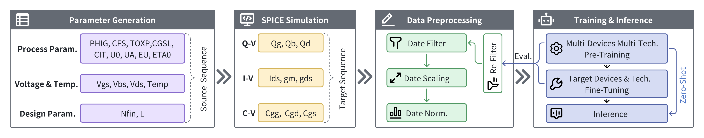
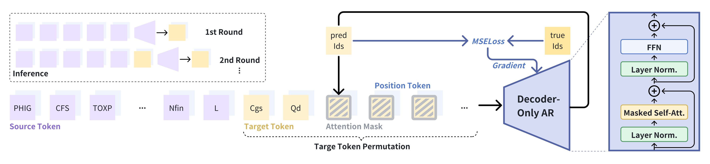
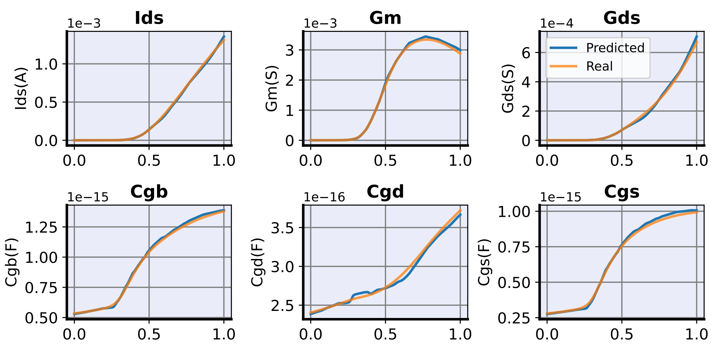
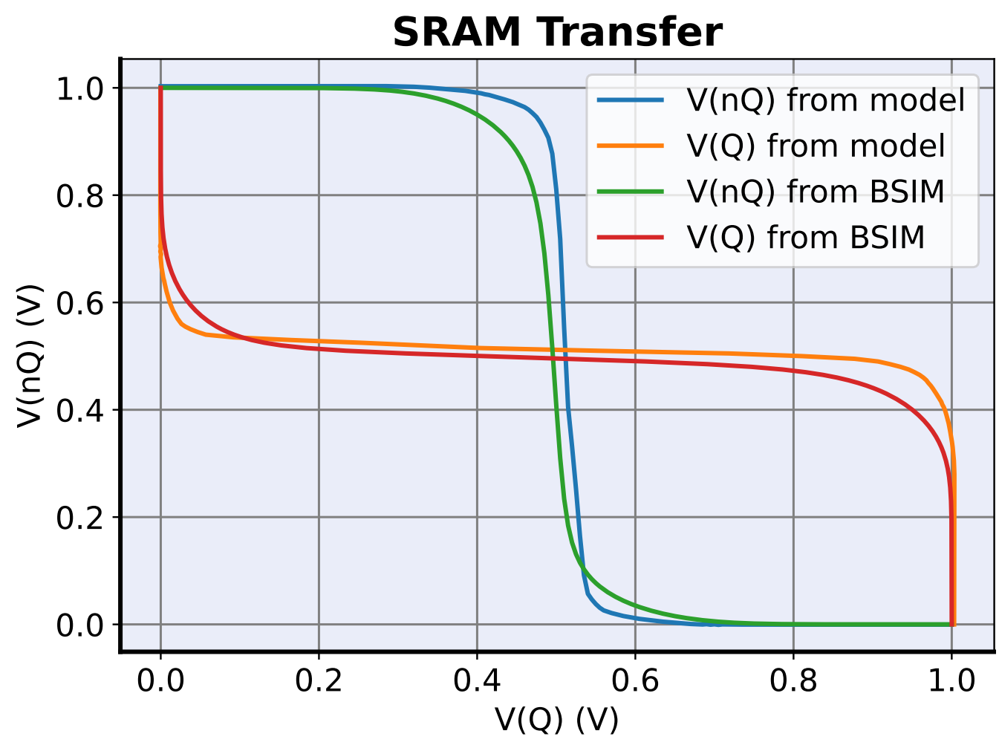

# BSIMAR: An Autoregressive Compact Model

[](https://opensource.org/licenses/MIT)
[](https://www.python.org/downloads/release/python-310/)
[](https://pytorch.org/)
[](https://pytorch-geometric.readthedocs.io/)

Official implementation of the paper "An Autoregressive Compact Model".

## 📑 Table of Contents

- [Overview](#overview)
- [Key Features](#key-features)
- [Repository Structure](#repository-structure)
- [Installation](#installation)
- [Usage](#usage)
  - [Model](#Model)
  - [Model Usage](#model-usage)
- [Framework Components](#framework-components)
- [Results](#results)
- [Citation](#citation)
- [License](#license)

## 🔍 Overview

BSIMAR, an autoregressive compact model that leverages large generative models to provide high accuracy, reduced calibration effort, and seamless integration into design workflows

Our framework supports simultaneous prediction of three target types:

- Predict the current-voltage (I-V) curve
- Predict the capacitance-voltage (C-V) curve
- Predict the charge-voltage (Q-V) curve:



## ✨ Key Features

BSIMAR addresses these challenges in Compact Model:

1. **Unified Autoregressive Modeling** - Given the process parameters and terminal voltages,our single AR model generates all key performance characteristics—including I-V, Q-V, and C-V curves—at once
2. **High Accuracy via Scaling Law** - Pre-training followed by fine-tuning enables the model to achieve high accuracy and strong generalization
3. **Scalable Simulation Acceleration** - The parallelization capability enables accelerated simulation of large-scale AMS circuits



## 📁 Repository Structure

BSIMAR is a unified package covering two complementary architectures:

- **`DirectNet`** — baseline MLP predicting all 13 outputs in a single
  forward pass. Fast to train, used as the reference for comparison.
- **`TransformerEncoderModel`** (BSIMAR v3) — autoregressive Transformer
  encoder with teacher forcing during training. Primary model, higher
  accuracy at higher inference cost. The v3 architecture hard-wires the
  winning recipe from the 2026-04-08 improvement sprint: `parallel_caps`
  (5 cap outputs emit in one parallel head), `grouped_inputs` (19 input
  scalars collapsed into 3 semantic group tokens), asinh + z-score
  normalisation, MAE + per-target LDS + Vov-LDS loss, BSIMAR column
  reorder, AR finetune tail, and the phys-best checkpoint tracker.

```
BSIMAR/
├── bsimar/                          # Python package — importable as `bsimar`
│   ├── config.py                    # TECH_CONFIGS + DirectNetConfig + TransformerConfig
│   ├── data/
│   │   ├── normalize.py             # BSIMARNormalizer (asinh / zscore) + BSIMARNormStats
│   │   ├── dataset.py               # MOSFETDataset + load_and_split_bsimar
│   │   └── analyze.py               # Dataset quality analysis
│   ├── models/
│   │   ├── direct_net.py            # Baseline MLP (DirectNet)
│   │   └── transformer.py           # BSIMAR v3 Transformer (parallel_caps + grouped_inputs)
│   ├── losses/
│   │   ├── direct_loss.py           # DirectLoss + ChargeConsistencyLoss (DirectNet)
│   │   └── bni_mae.py               # MAELoss + compute_lds_weights_per_target (BSIMAR)
│   ├── training/
│   │   ├── early_stopping.py
│   │   └── trainer.py               # train_directnet, train_transformer
│   ├── eval/
│   │   ├── metrics.py               # compute_physical_metrics
│   │   └── visualization.py         # scatter / loss-curve plots
│   ├── utils/seed.py
│   └── cli/train.py                 # `python -m bsimar.cli.train --model {direct,transformer}`
├── checkpoints/                     # Trained weights (.pt + _norm.npz + _config.npz) — gitignored
├── results/                         # Training plots — gitignored
├── docs/                            # Reference paper, improvement plan, sprint reports
├── imgs/                            # README imagery
├── requirments.txt                  # Python dependencies
└── README.md
```

Data is produced by PyCMG's data generator:

```bash
python external_compact_models/PyCMG/scripts/generate_nn_data.py \
    --device both --universal
```

## 💻 Installation

### Prerequisites

- Python 3.10+
- CUDA-compatible GPU (recommended)

### Setup Instructions

```bash
# Clone the repository
git clone https://github.com/username/BSIMAR.git
cd BSIMAR

# Create and activate a conda environment
conda create -n BSIMAR python=3.10
conda activate BSIMAR

# Install dependencies
pip install -r requirements.txt
```

## 🚀 Usage

### Model

#### Models Download Instructions

The offering includes a pre-trained model and a version fine-tuned for 7nm nch_svt devices, allowing users to further customize the fine-tuned model based on their individual prediction targets.
##### List of Models(test=7nm_nch_svt)

| Model                                                                                | Train Size  | Test Size  | #Params| FLOPs | AP<sup>val</sup>|
| ------------------------------------------------------------------------------------ | --------------------- | -------------------- | ------------------------------ | ----------------------------------- | ------------------ |
| [zero_shot_model](models/best_pretrain_model.pth)            | 18442944                  |80000                 | 111,915                     | 43.61G                           | 9.41%(test=7nm_nch_svt)                |
| [zero_shot_model](models/best_pretrain_model.pth)            | 18442944                  |80000                 | 111,915                     | 43.61G                           | 18.56%(test=7nm_pch_svt)               |
| [fine_tune_model_n](models/models/best_finetune_model_n.pth) | 8000                      |80000                 | 111,915                     | 43.61G                           | 6.99%(test=7nm_nch_svt)                |
| [fine_tune_model_p](models/models/best_finetune_model_p.pth) | 8000                      |80000                 | 111,915                     | 43.61G                           | 10.11%%(test=7nm_pch_svt)              |

### Model usage

#### Basic usage

```bash
# Train DirectNet (baseline MLP, zscore norm, DirectLoss)
conda run -n pycircuitsim python -u -m bsimar.cli.train \
    --model direct --device-type nmos --universal --mode direct13 \
    --epochs 800 --hidden 384 --layers 6 --batch-size 2048 --cuda

# Train BSIMAR v3 Transformer (production recipe).
# The winning recipe is hard-wired inside train_transformer:
#   loss      = MAE + per-target LDS + Vov-LDS
#   norm      = asinh + z-score
#   arch      = parallel_caps + grouped_inputs
#   reorder   = BSIMAR column order (Q → I-V → C)
#   finetune  = AR-rollout fine-tune (default 5 epochs)
#   ckpt sel  = phys-space-best tracker
# Only architecture and schedule are user-tunable.
conda run -n pycircuitsim python -u -m bsimar.cli.train \
    --model transformer --device-type nmos --universal --cuda
```

Both commands read `external_compact_models/bsimar/data/datasets/*.npz`
(or a path you pass via `--data`) and write checkpoints + plots under
`external_compact_models/bsimar/{checkpoints,results}/`.

#### BSIMAR v3 Medium results on `universal_nmos`

| Metric | Value |
|---|---:|
| NRMSE_phys | **0.223 %** |
| MRE_phys | **1.41 %** |
| R²_phys | **0.9984** |
| Params | 5,152,525 |
| Wall-clock | ~107 min on one Blackwell GPU |

Achieved by running the default recipe on the Medium configuration:

```bash
conda run -n pycircuitsim python -u -m bsimar.cli.train \
    --model transformer --device-type nmos --universal \
    --d-model 256 --nhead 8 --num-layers 6 --dim-feedforward 1024 \
    --epochs 150 --batch-size 1024 --lr 8e-4 --patience 150 \
    --ar-finetune-epochs 5 --seed 42 --cuda
```

For the full sprint narrative (which changes worked, which
didn't, and why), see
[`docs/bsimar_improvement_plan_2026_04_08.md`](docs/bsimar_improvement_plan_2026_04_08.md).

#### Checkpoints

A BSIMAR Transformer run produces five files per `--exp-name`:

| File | Purpose |
|---|---|
| `<exp>_best.pt`       | TF-val-best checkpoint |
| `<exp>_best.ar.pt`    | AR-val-best checkpoint |
| `<exp>_best.phys.pt`  | **Phys-space-best** — load this for the simulator |
| `<exp>_norm.npz`      | `BSIMARNormStats` (asinh mode) |
| `<exp>_config.npz`    | Architecture config |


## 🧠 Framework Components

### 1. Unsupervised pre-training+Supervised fine-tuning

Our model achieves precise predictions for specific tasks by first undergoing extensive unsupervised pre-training across multiple process nodes and various devices, followed by supervised fine-tuning on the target task. Key features include:

- Pre-training and fine-tuning strategies
- Sampling techniques for pre-training and fine-tuning datasets


### 2. Implementation of the autoregressive structure


- **Target random order** - To make the predictions as independent as possible from the target output order
- **Step-by-step prediction** - The previous prediction is fed as input to the next prediction, allowing subsequent predictions to benefit from the information in earlier ones

## 📊 Results

Our approach delivers better performance compared to existing model architectures.

### Predicted I-V and C-V curves



### SRAM simulation



#### Complete Performance Comparison Table

| Model             | $I_{ds}$   | $g_m$     | $g_{ds}$  | $Q_g$     | $Q_b$     | $Q_d$     | $C_{gg}$  | $C_{gd}$  | $C_{gs}$  | Average   |
|-------------------|------------|-----------|-----------|-----------|-----------|-----------|-----------|-----------|-----------|-----------|
| LogicTree         | 22.21%     | 32.13%    | 36.21%    | 62.31%    | 14.48%    | 21.75%    | 19.42%    | 23.37%    | 29.61%    | 29.05%    |
| ANN               | 31.78%     | 24.17%    | 16.52%    | 20.30%    | 22.09%    | 18.30%    | 7.74%     | 14.85%    | 9.40%     | 18.35%    |
| MLP               | 5.18%      | 16.37%    | 10.95%    | 14.80%    | 9.44%     | 17.54%    | 4.94%     | 12.66%    | 4.43%     | 10.70%    |
| E-D               | 41.54%     | 35.84%    | 39.09%    | 38.98%    | 28.18%    | 22.19%    | 16.48%    | 14.26%    | 15.99%    | 28.06%    |
| ZS BSIMAR         | 14.1%      | 11.4%     | 14.6%     | 16.3%     | 4.06%     | 13.6%     | 2.18%     | 3.10%     | 5.27%     | **9.41%** | 
| FT BSIMAR         | 11.1%      | 8.73%     | 8.94%     | 11.84%    | 6.61%     | 7.80%     | 2.93%     | 1.55%     | 3.42%     | **6.99%** |


#### Zero-Shot VS Fine-Tuning MRE

| Tech. Device | $I_{ds}$ | $g_m$ | $g_{ds}$ | $Q_g$ | $Q_b$ | $Q_d$ | $C_{gg}$ | $C_{gd}$ | $C_{gs}$ | Average |
|--------------|----------|-------|----------|-------|-------|-------|----------|----------|----------|---------|
| **7nm**      |          |       |          |       |       |       |          |          |          |         |
| nch_svt      | 14.1%    | 11.4% | 14.6%    | 16.3% | 4.06% | 13.6% | 2.18%    | 3.10%    | 5.27%    | 9.41%   |
| nch_svt+ft   | 11.1% -2.98% | 8.73% -2.71% | 8.94% -5.70% | 11.84% -4.50% | 6.61% +2.55% | 7.80% -5.80% | 2.93% +0.75% | 1.55% -1.55% | 3.42% -1.85% | 6.99% -2.42% |
| nch_lvt      | 15.7%    | 12.8% | 15.4%    | 12.1% | 8.85% | 11.4% | 2.48%    | 3.43%    | 4.85%    | 9.67%   |
| nch_lvt+ft   | 5.37% -10.30% | 6.14% -6.69% | 3.99% -11.43% | 10.85% -1.21% | 5.68% -3.17% | 7.15% -4.28% | 3.24% +0.76% | 1.45% -1.98% | 2.66% -2.19% | 5.17% -4.50% |
| pch_svt      | 10.9%    | 12.7% | 4.33%    | 32.1% | 8.29% | 26.3% | 5.57%    | 5.67%    | 6.39%    | 12.5%   |
| pch_svt+ft   | 10.9% -0.08% | 6.09% -6.59% | 8.67% +4.34% | 23.1% -8.95% | 5.97% -2.32% | 18.5% -7.79% | 7.75% +2.18% | 3.92% -1.75% | 7.89% +1.50% | 10.3% -2.16% |
| pch_lvt      | 9.46%    | 20.8% | 6.27%    | 41.6% | 29.3% | 32.9% | 8.12%    | 5.28%    | 8.34%    | 18.0%   |
| pch_lvt+ft | 11.4% +1.95% | 17.6% -3.20% | 23.8% +17.6% | 13.9% -27.5% | 11.13% -18.1% | 12.5% -20.5% | 7.33% -0.79% | 4.97% -0.31% | 7.82% -0.52% | 12.3% -5.73% |
| **12nm**     |          |       |          |       |       |       |          |          |          |         |
| nch_svt      | 7.26%    | 14.6% | 21.9%    | 14.4% | 12.3% | 5.20% | 1.52%    | 1.58%    | 2.11%    | 9.00%   |
| nch_svt+ft   | 4.99% -2.27% | 7.21% -7.36% | 17.69% -4.26% | 11.8% -2.58% | 1.76% -10.5% | 10.2% +4.98% | 2.09% +0.57% | 1.31% -0.27% | 3.00% +0.89% | 6.67% -2.32% |
| nch_lvt      | 6.42%    | 10.8% | 18.8%    | 15.1% | 11.7% | 6.49% | 1.35%    | 1.61%    | 2.95%    | 8.36%   |
| nch_lvt+ft   | 8.28% +1.86% | 4.80% -5.98% | 4.63% -14.20% | 7.64% -7.49% | 4.09% -7.63% | 7.92% +1.43% | 2.28% +0.93% | 1.99% +0.38% | 2.65% -0.30% | 4.92% -3.44% |
| pch_svt      | 4.82%    | 14.0% | 7.37%    | 18.4% | 6.00% | 7.30% | 1.81%    | 1.34%    | 2.30%    | 7.04%   |
| pch_svt+ft   | 3.38% -1.44% | 5.88% -8.16% | 23.1% +15.7% | 5.61% -12.8% | 2.00% -4.00% | 6.01% -1.29% | 1.33% -0.48% | 1.20% -0.14% | 1.79% -0.51% | 5.59% -1.45% |
| pch_lvt      | 10.09%   | 17.5% | 7.95%    | 20.4% | 3.73% | 10.4% | 2.24%    | 2.78%    | 2.95%    | 8.67%   |
| pch_lvt+ft   | 3.47% -6.62% | 4.56% -12.9% | 14.1% -3.89% | 16.5% -3.89% | 6.67% +2.94% | 8.73% -1.70% | 2.29% +0.05% | 1.56% -1.22% | 2.32% -0.63% | 6.69% -1.98% |
| **16nm**     |          |       |          |       |       |       |          |          |          |         |
| nch_svt      | 7.13%    | 9.39% | 28.5%    | 14.46% | 10.5% | 7.03% | 2.65%    | 2.30%    | 4.40%    | 9.60%   |
| nch_svt+ft   | 5.86% -1.27% | 7.19% -2.20% | 1.43% -27.09% | 6.19% -8.27% | 2.17% -8.35% | 4.71% -2.32% | 1.50% -1.15% | 1.65% -0.65% | 2.18% -2.22% | 3.65% -5.95% |
| nch_lvt      | 5.12%    | 7.47% | 23.13%   | 13.6% | 13.7% | 5.67% | 2.22%    | 2.22%    | 4.18%    | 8.60%   |
| nch_lvt+ft   | 7.23% +2.11% | 7.28% -0.19% | 11.06% -12.1% | 10.1% -3.57% | 6.21% -7.52% | 12.33% +6.66% | 2.43% +0.21% | 2.27% +0.05% | 2.86% -1.32% | 6.86% -1.74% |
| pch_svt      | 5.14%    | 8.43% | 21.97%   | 16.9% | 4.94% | 5.68% | 1.34%    | 1.81%    | 2.32%    | 7.61%   |
| pch_svt+ft   | 4.60% -0.54% | 9.83% +1.40% | 8.25% -13.72% | 7.38% -9.47% | 3.16% -1.78% | 7.46% +1.78% | 1.78% +0.44% | 0.75% -1.06% | 2.84% +0.52% | 5.12% -2.49% |
| pch_lvt      | 11.2%    | 16.2% | 19.6%    | 25.6% | 4.76% | 11.4% | 1.07%    | 1.85%    | 1.93%    | 10.4%   |
| pch_lvt+ft   | 4.33% -6.85% | 5.71% -10.5% | 4.96% -14.6% | 7.77% -17.79% | 2.27% -2.49% | 5.12% -6.23% | 1.40% +0.33% | 1.43% -0.42% | 1.93% +0.00% | 3.88% -6.51% |
## 📝 Citation

If you find this work useful for your research, please consider citing:

```bibtex
@article{BSIMAR2025,
  title={An Autoregressive Compact Model},
  author={Author1 and Author2 and Author3},
  journal={Conference/Journal Name},
  year={2025},
  publisher={Publisher}
}
```

## 📄 License

This project is licensed under the MIT License - see the LICENSE file for details.


